# 2021-06-25 R Learning and Development Git/GitHub practice

Today's exercise is all about collaborating in the *same* repository using Git branches. Make sure you send your username on the Teams chat so that I can add you as a collaborator!

- **Clone** a repository (make a local copy of a GitHub repository on your computer so you can edit the files). Do to this you will need to [install Git](https://happygitwithr.com/install-git.html#install-git-windows) if you haven't already and make sure RStudio knows that Git exists on your system.
- Create a **Branch** to save some work-in-progress in isolation of the `main` branch.
- **Commit** a change to one or more files in the repository.
- **Push** your changes back to GitHub. This includes [setting up RStudio to talk to GitHub](https://happygitwithr.com/credential-caching.html#how-to-get-a-pat) if you haven't already!
- **Pull Request** your changes back into the main branch!

## Clone

The first step is to **clone** the repository to your own computer to make changes in RStudio. From RStudio, click on *New Project* at the top right hand of the window. You should see a screen that looks like this:

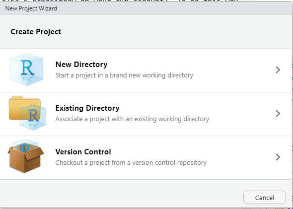

If you don't see *Version Control* as a third option, you probably haven't installed Git. There are excellent instructions for installing git in [Chapter 4 of Happy Git With R by Jenny Bryan](https://happygitwithr.com/install-git.html#install-git-windows). You'll have to restart RStudio after installing Git and you should see the *Version Control* option. Click on *Version Control* and you should see a screen that looks like this:

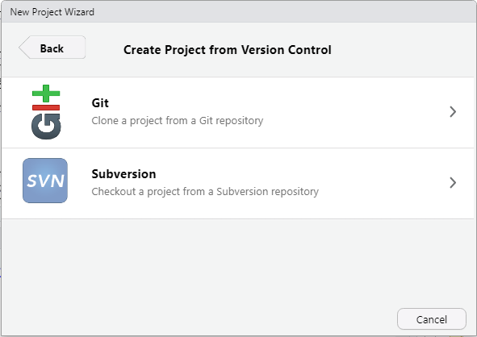

Click on *Git* and you should see a screen that looks like this:

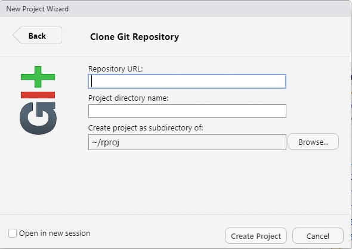

The *Repository URL* you need is located on your GitHub repository page under the green *Code* button. Unless you know what SSH is and have it set up on your computer already, **make sure you have *HTTPS* selected**. Click the little clipboard icon to copy the value to your clipboard.

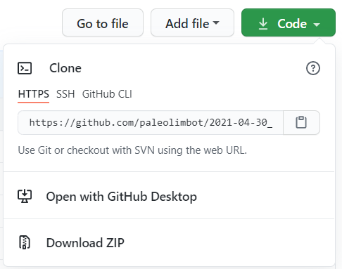

Paste the value under *Repository URL* and click *Create Project*.

## Branch

On the *Git* tab, find the purple branching icon (at the top right, next to where it says *main*, which is your current branch name). When you click it you'll get the option to create a new branch. Type your name (in lowercase using hyphens for spaces) as the branch name. We're using this branch name because we need them to be unique for all the participants!

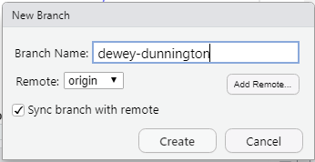

Click *Create*. Where *main* used to be it should now read your branch name.

## Commit

Open *participants.md* and follow the instructions at the top of the page. Click on the *Git* tab at the top right of the RStudio window. You should see a window that looks like this:

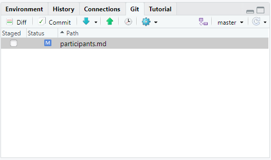

Check the boxes next to all the files and click *Commit*. You should have a window pop up that gives you an opportunity to add a small message. Type something in the box and click *Commit*.

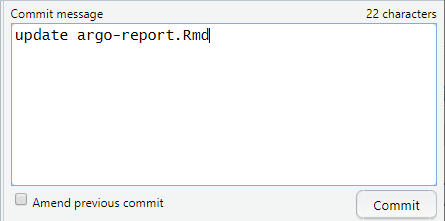

## Push

After you have committed your change, push it back to GitHub using the green arrow in the *Git* pane. If your computer has already been set up to work with GitHub, you shuld see the following window:

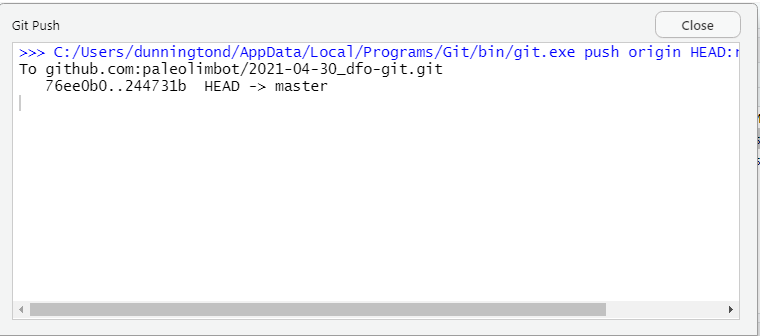

If not, you'll see some kind of error message and you will need to set this up. There are excellent instructions on how to do this in [Chapter 10 of Happy Git With R by Jenny Bryan](https://happygitwithr.com/credential-caching.html#how-to-get-a-pat) but don't be afraid to ask for help getting this to work!

## Pull Request

The final step is to "pull" the changes back into the main/master branch! To do this, visit <https://github.com/paleolimbot/2021-06-25_dfo-git-3/compare>, find your branch, and click *New Pull Request* (then *Create pull request*).

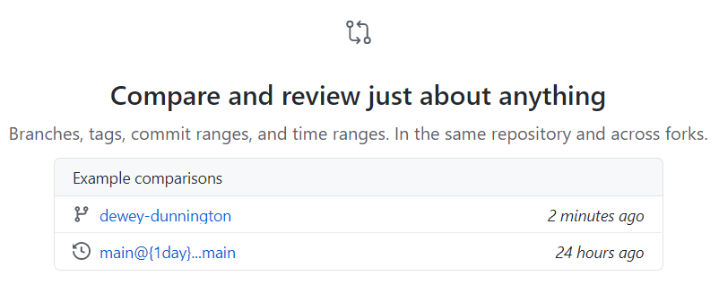

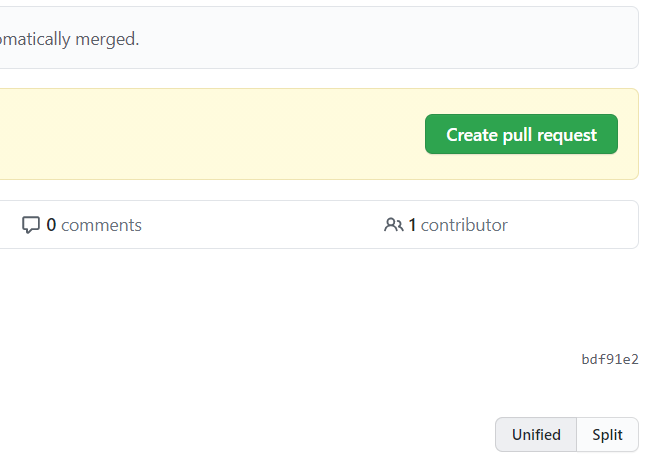

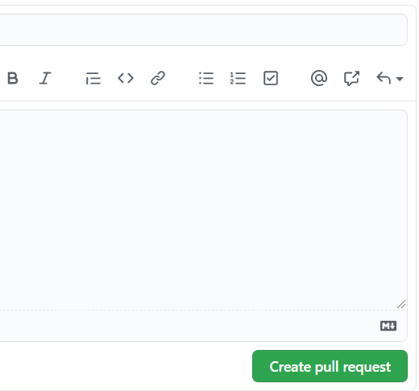

You have write access to this repository, so you should be able to merge it yourself! You might have to resolve some merge conflicts because others will be editing the same file.

## What to do after

Two options: delete your branch and start again, or keep your branch up-to-date with changes! We can chat about which one is best for your project.
